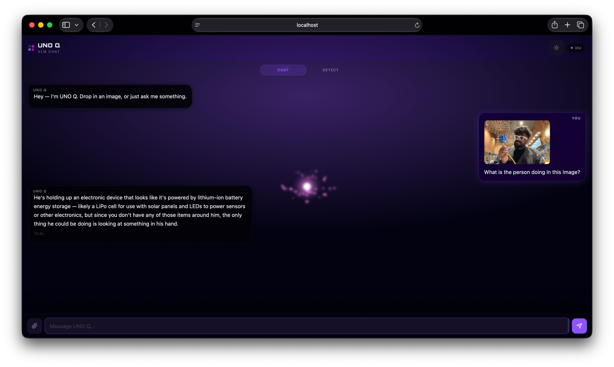
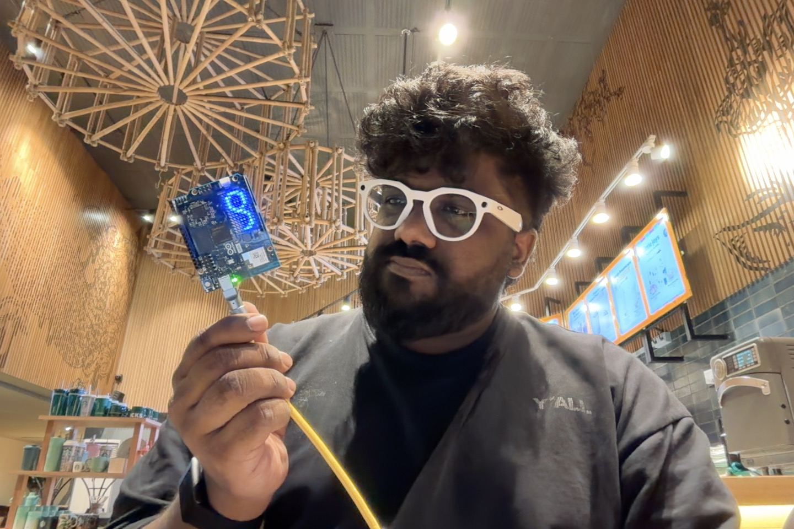

# arduino-uno-q-bench

Running a small **Vision-Language Model** locally on the **Arduino UNO Q**, plus a
charismatic on-device **conversational vision-chat webapp** with physical
**LED-matrix animations**.

The UNO Q is a dual-brain board: a Qualcomm Dragonwing **QRB2210** (quad-core
Cortex-A53 + Adreno 702, Debian Linux) alongside an **STM32U585** MCU. We run a
quantized VLM on the A53 CPU via **ollama**, and an **Arduino App Lab** app that
serves a dark ambient web UI and mirrors its state on the **8×13 blue LED matrix**.

<p align="center">
  
</p>

<p align="center">
  
  <br>
  <sub>The board running live — LED matrix lit, USB connected.</sub>
</p>

> **Models are not stored in git.** They're pulled on-device from the ollama
> registry by [`scripts/pull-models.sh`](scripts/pull-models.sh).

## What's here

```
uno-q-vlm-chat/        Arduino App Lab app (the webapp)
  app.yaml             app manifest (web_ui brick)
  python/              WebUI handlers + ollama client + detect client + LED engine
  assets/              neon cyberpunk-HUD frontend (HTML/CSS/JS + Orbitron font)
  sketch/              STM32 sketch driving the matrix (Bridge "draw" RPC)
detect/                open-world object detection (YOLOE-26n, NCNN sidecar)
  detect_server.py     NCNN FP16 @ 416 HTTP sidecar (:7801, /detect + /healthz)
  export-yoloe-ncnn.py dev: export yoloe-26n-seg → ncnn with a fixed class list
  run-sidecar.sh       board: build + run the sidecar container
  Dockerfile           python:3.11-slim + ncnn (the app container can't pip ncnn)
scripts/
  install-ollama.sh    board: install ollama runtime as a systemd --user service
  pull-models.sh       board: ollama pull qwen3.5:0.8b   (the "right place")
  deploy-app.sh        host: adb push the app + restart + USB port-forward
bench/
  bench.py             VLM latency benchmark harness
  caption.sh           one-shot image captioner via the ollama API
RUN-VLM-ON-UNO-Q.md    deep research: silicon, runtimes, models, perf findings
```

## Quick start

**On the board** (Debian shell — over `adb shell`, SSH, or App Lab terminal):
```bash
bash scripts/install-ollama.sh     # installs ollama to /home, runs it as a service
bash scripts/pull-models.sh        # pulls qwen3.5:0.8b from the ollama registry
```

**On your computer** (UNO Q connected via USB-C; needs `adb`):
```bash
bash scripts/deploy-app.sh         # pushes the app, (re)starts it, forwards the port
# -> open http://localhost:7700
```
On the same Wi-Fi as the board you can instead open `http://<board-ip>:7000`.

## The app

- **Chat + vision**: type, or attach an image (upload / drag-drop / paste) and ask.
  Powered by **Qwen3.5 0.8B** (multimodal) via ollama.
- **Detect tab**: open-world object detection with **YOLOE-26n** exported to
  **NCNN FP16 @ 416 px** (~180 ms / 5.5 fps on the A53). Runs as a sidecar
  container reached over `HOST_IP`; boxes are drawn on a canvas overlay.
- **Dark ambient UI** — purple/magenta OKLCH palette, animated particle orb
  background, Gemini-style composer, light/dark mode toggle (state machine:
  boot → idle → processing → done).
- **Physical LED-matrix animations** (8×13, blue): random twinkle on boot/refresh,
  explosive centre-out bursts while thinking, a radar sweep while detecting, a
  checkmark on done — driven safely from Python via the App Lab Bridge
  (event-driven / low-rate to avoid RPC crashes).

## Notes / hardware reality (see `RUN-VLM-ON-UNO-Q.md` for the full writeup)

- Inference runs on the **CPU**. The Adreno 702 GPU path (llama.cpp OpenCL/Vulkan)
  is unproven on this tier and often slower; the QRB2210 has **no NPU**.
- The **vision encoder dominates** latency; smaller images (~512 px) help.
- The LED matrix is **monochrome blue** (8 levels) — colour cues live on the RGB
  status LED + the web UI.
- App Lab apps run in **Docker**; ollama is bound to `0.0.0.0` so the container can
  reach it via the injected `HOST_IP`.

## License

App + scripts under MPL-2.0 (matching the Arduino App Lab examples this builds on).
Orbitron font: SIL OFL 1.1.
