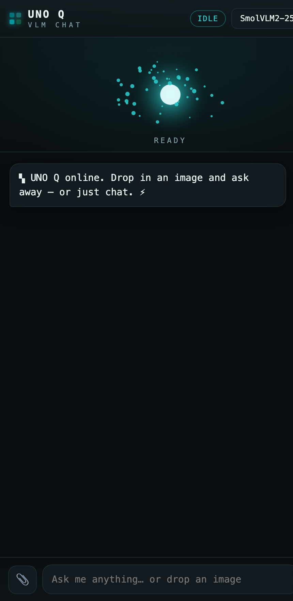

# UNO Q VLM Chat

A funky, on-device conversational **vision** agent for the Arduino UNO Q. Runs as
a native Arduino App Lab app (containerized, port **7000**), talks to a local
ollama VLM, and mirrors its state on the physical **8×13 LED matrix** + RGB LED.



## Access
- Open **`http://<board-ip>:7000`** from any device on the same Wi-Fi.
  - Current board IP: `10.31.86.98` (DHCP — changes if the board roams networks;
    on a stable home Wi-Fi it stays put). Find it with:
    `arp -a | grep -i 14:b5:cd:e7:7c:69` from a machine on the same LAN.
- Type a message, attach an image (📎 / drag-drop / paste), pick a model, send.
- Images are auto-downscaled to ~512 px in the browser (the speed sweet spot).

## Models (switcher in the UI)
- **SmolVLM2-256M ⚡** (default) — fast (~20 s) image captioning; weak at multi-turn chat.
- **qwen3.5:0.8b 💭** — slower (~25–60 s) but a real conversationalist + vision.

## State animations (browser + board)
| State | Browser hero canvas | 8×13 matrix | RGB LED |
|---|---|---|---|
| boot | dot-grid sweep → orb | diagonal wipe | teal fade |
| idle | breathing orb + particles | heartbeat pulse | green breathe |
| processing | scan + rotating arc | KITT scan bar | blue pulse |
| done | green ripple + check | checkmark | green flash |

## Architecture
```
browser → http://board:7000 (WebUI brick)
  /config, /chat  →  python/main.py
       │  ollama_client → http://$HOST_IP:11434 (ollama on host, bound 0.0.0.0)
       │  animator → Bridge.call("draw", frame_bytes) → STM32 sketch → matrix
       └           → /dev/leds/builtin/led1_* (RGB LED)
```
- `python/main.py` — WebUI handlers (`/config`, `/chat`) + boot the animator.
- `python/ollama_client.py` — stdlib client; resolves host via `HOST_IP`.
- `python/animator.py` — background thread; state → matrix frames + RGB LED.
- `python/frames.py` — pure-Python 8×13 frame generators (0–7 grayscale).
- `assets/` — `index.html`, `app.js` (chat + Canvas animations), `style.css`.
- `sketch/` — reused from the `led-matrix-painter` example (`draw` RPC provider).

## Resilience (already configured on the board)
- **ollama** runs as a **systemd --user service** (`~/.config/systemd/user/ollama.service`,
  `Restart=always`, `OLLAMA_HOST=0.0.0.0`, `OLLAMA_MAX_LOADED_MODELS=1` to avoid
  OOM on 3.6 GB). **Linger is enabled**, so it survives logout *and* reboot.
- **App container** has `--restart unless-stopped` (auto-recovers + starts on boot).

## Managing it (on the board)
```bash
# app
arduino-app-cli app start   /home/arduino/ArduinoApps/uno-q-vlm-chat
arduino-app-cli app stop    /home/arduino/ArduinoApps/uno-q-vlm-chat
arduino-app-cli app logs    /home/arduino/ArduinoApps/uno-q-vlm-chat
# ollama
systemctl --user status  ollama
systemctl --user restart ollama
journalctl --user -u ollama -f
```

## Redeploy after local edits
```bash
B=arduino@<board-ip>; APP=/home/arduino/ArduinoApps/uno-q-vlm-chat
scp -i ~/.ssh/uno_q python/*.py  $B:$APP/python/
scp -i ~/.ssh/uno_q assets/*.{html,js,css} $B:$APP/assets/
ssh -i ~/.ssh/uno_q $B "arduino-app-cli app restart $APP"
```

## Notes / known limitations
- The board roams DHCP IPs on mobile/hotspot networks; prefer a stable Wi-Fi for a
  fixed URL. (mDNS `jamespocketq.local` didn't resolve cross-subnet in testing.)
- Voice was deferred (text + image only). Adding browser voice later needs HTTPS
  (Web Speech API requires a secure context over a LAN IP).
- Conversation history is client-held; the server is stateless per request.
